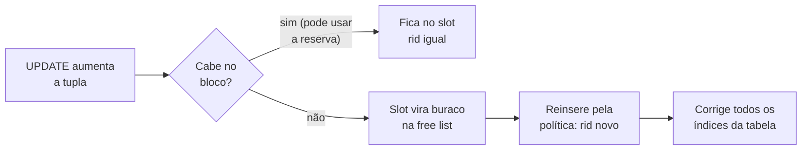

# 💾 Organização de Arquivos de Dados

> **Objetivo:** dada uma sequência de `INSERT`, `DELETE` e `UPDATE`, desenhar como fica o arquivo de dados de cada tabela: em que bloco e em que slot cada tupla mora (o **rid**), o que vai para a **free list** e quando uma tupla **migra**.

---

## 🧱 1. Conceitos de apoio

| Conceito | O que é | Por que importa no exercício |
| :-- | :-- | :-- |
| **Bloco (página)** | Unidade de transferência entre disco e memória. Para ler 1 byte, lê-se o bloco inteiro. | Todo custo é contado em blocos; todo arquivo é uma sequência de blocos. |
| **Registro** | Sequência de campos: uma tupla. | O tamanho dele decide em que bloco ele cabe. |
| **Fixo vs variável** | Fixo: só campos de tamanho fixo (`INT`, `CHAR`). Variável: tem `VARCHAR`, campo opcional ou repetido. | Com `VARCHAR`, cada tupla tem um tamanho diferente. |
| **Unspanned** | O registro não atravessa a fronteira do bloco. | Se não cabe inteiro, vai para outro bloco, e a sobra fica vazia. |
| **Spanned** | O registro continua em outro bloco, ligado por ponteiro. | Só quando o enunciado permitir. |
| **Fator de bloco (Bfr)** | Registros por bloco: $Bfr = \lfloor B/R \rfloor$. | Com ele, $b = \lceil r/Bfr \rceil$ blocos. |
| **Header do arquivo** | Descritor do arquivo: número de blocos, endereços, formato. | Entra no diagrama da resposta. |
| **Orientado a linha** | A tupla inteira fica junta no bloco (o oposto é o armazenamento colunar). | O "registro" é a linha toda. |

**Estrutura do bloco (slotted page).** O bloco começa com um header que guarda o número de entradas e um **diretório de slots** (posição e tamanho de cada registro). Os registros crescem do fim para o começo, e o espaço livre fica no meio. O rid aponta para o *slot*, então mover um registro dentro do próprio bloco não muda o rid.

```
┌─────────────┬────────┬────────┬────────┬─────────────┬────┬────┬────┐
│ nº entradas │ slot 1 │ slot 2 │ slot 3 │  → livre ←  │ R3 │ R2 │ R1 │
└─────────────┴────────┴────────┴────────┴─────────────┴────┴────┴────┘
 └──── header do bloco (diretório de slots) ───┘        registros ←──
```

> ⚠️ Se o enunciado não der o tamanho do header do bloco, **não desconte nada**: o bloco inteiro é espaço útil.

**Organizações de arquivo**

| Organização | Inserção | Busca | Observação |
| :-- | :-- | :-- | :-- |
| **Heap (não ordenado)** | Barata: em qualquer lugar com espaço | Linear (lê tudo) | É o caso do exercício: a política (first-fit etc.) decide o bloco. |
| **Ordenado (sequencial)** | Cara: mantém a ordem, reorganiza | Busca binária | Ler em ordem da chave é muito eficiente. |
| **Hash** | Função hash do campo → bloco | Ótima só para igualdade | Colisões: endereçamento aberto, encadeamento, hash múltiplo. |

**Remoção:** ou se reescreve o bloco (compactando), ou se usa **marcador de remoção + free list**. No segundo caso, o buraco fica onde está e é reaproveitado depois. É o modelo do exercício.

---

## 📏 2. Tamanho de cada registro

O tamanho do registro é a soma dos campos: $R = \sum \text{campos}$.

| Tipo | Ocupa | Exemplo (2 bytes por caractere) |
| :-- | :-- | :-- |
| `INT` | O que o enunciado disser | 8 B |
| `CHAR(n)` | **Sempre** $n \times$ bytes/caractere, mesmo com texto menor | `CHAR(10)` com `'Nike'` = 20 B |
| `VARCHAR(n)` | **Só os caracteres usados** $\times$ bytes/caractere | `'Winflo 10'` = 9 × 2 = 18 B |
| Espaço, hífen | Contam como caractere | `'Gel-Nimbus'` = 10 caracteres |

* 🔢 Um valor `'1'` (texto) numa coluna `INT` é convertido e continua ocupando o tamanho do `INT`.
* 🔢 `DEFAULT nextval('seq')` numera na ordem dos `INSERT`: 1, 2, 3, …
* 📐 Prefixo de tamanho do `VARCHAR` e header de bloco só entram na conta quando o enunciado os informa.

---

## 🧮 3. PCTFREE: reserva para UPDATE

$$\text{limite do INSERT} = \left\lfloor B \times \left(1 - \frac{\text{PCTFREE}}{100}\right) \right\rfloor$$

* `PCTFREE 5` com bloco de 256 B: $\lfloor 256 \times 0{,}95 \rfloor = \lfloor 243{,}2 \rfloor = 243$ B para `INSERT`. Os 13 B restantes (5% de 256) ficam reservados.
* `PCTFREE 0`: o `INSERT` pode usar os 256 B.
* O **INSERT** ocupa só até o limite. O **UPDATE** pode usar a reserva, até encher o bloco ($B$).

---

## 🔀 4. Em que bloco o INSERT cai

| Política | Regra |
| :-- | :-- |
| **First-fit** | Percorre os blocos a partir do 01 e usa o **primeiro** onde a tupla cabe: um buraco da free list (em ordem de rid) com tamanho ≥ tupla, ou o espaço livre do bloco, respeitando o limite do PCTFREE. |
| **Best-fit** | Usa o lugar onde **sobra menos** espaço. |
| **Worst-fit** | Usa o lugar onde **sobra mais** espaço. |
| **Next-fit** | Como o first-fit, mas continua de onde parou a última inserção. |
| **Encher o último bloco** | Só olha o último bloco; se não cabe, abre outro. Não reaproveita espaço anterior. |

* Nenhum bloco serve → abre um bloco novo no fim do arquivo, e o header ganha +1 bloco.
* ⚠️ No first-fit, uma tupla inserida depois pode cair num bloco **anterior**, se ainda houver espaço lá. É aqui que a resposta muda de uma política para outra.
* ⚠️ Tupla maior que o buraco, mas que caberia somando o buraco ao resto do espaço livre do bloco: isso depende de compactar o bloco. Diga o que assumiu.

---

## 🗑️ 5. Efeito de cada operação

| Operação | O que acontece no arquivo | rid | Índices |
| :-- | :-- | :-- | :-- |
| `INSERT` | Entra pela política (first-fit), até o limite do PCTFREE. | Novo | Ganham uma entrada. |
| `DELETE` | A tupla sai e **ninguém se move**: o buraco vira `<rid, tamanho>` na free list, ordenada por rid. | Deixa de existir | Perdem a entrada. |
| `UPDATE` que cabe | Cresce no lugar, podendo usar a reserva do PCTFREE. | Igual | Nada muda (se a chave não mudou). |
| `UPDATE` que não cabe | **Migra**: o slot antigo vira buraco na free list e a tupla é reinserida pela política. | **Muda** | **Todos** os índices da tabela são corrigidos. |



* 🔗 A chave estrangeira de **outras** tabelas não muda: ela guarda o **valor** (ex.: `brand_id = 1`), não o endereço.
* 📌 No modelo deste exercício, o rid muda e os índices são corrigidos. SGBDs como o Oracle mantêm o rid deixando um ponteiro de encaminhamento no slot antigo (*row migration*). Use essa variante só se o enunciado pedir.

---

## 🖼️ 6. Como desenhar a resposta

* **rid no formato PPRR**: `PP` é o bloco e `RR` o slot dentro do bloco, ambos a partir de 01. `0302` é o 2º registro do 3º bloco.
* Cada tupla é `[chave, ...]`, e cada buraco é `(livre, N B)`. Anote a ocupação de cada bloco, o header e a free list.

```
<tabela>   header: N blocos   free list: <PPRR, tamanho> -> ...
┌─ bloco 01 ──────────────────────────────────────────────┐
│ [chave, ...] [chave, ...] (livre, 46 B) [chave, ...]    │ usado/B
├─ bloco 02 ──────────────────────────────────────────────┤
│ [chave, ...] [chave, ...]                               │ usado/B
└─────────────────────────────────────────────────────────┘
```

---

## ✅ 7. Receita na prova

1. **Tamanho de cada tupla**: some os campos (`CHAR` cheio, `VARCHAR` pelo uso, × bytes por caractere). Faça uma tabela com uma linha por tupla, incluindo o tamanho **depois** de cada `UPDATE`.
2. **Limite do INSERT** de cada tabela, pelo PCTFREE (arredonde para baixo).
3. **Insira uma por uma** pela política do enunciado, anotando a ocupação de cada bloco e o rid.
4. **DELETE**: apague sem mover ninguém e anote `<rid, tamanho>` na free list, em ordem de rid.
5. **INSERT depois de DELETE**: confira os buracos da free list antes do fim dos blocos (o first-fit percorre na ordem).
6. **UPDATE**: veja se cabe no bloco usando a reserva. Se não cabe, migre, mude o rid e diga que os índices são corrigidos.
7. **Desenhe** o arquivo final: header, free list e blocos com ocupação. Escreva a política que aplicou.

<div class="page"></div>

## 📝 8. Exemplo resolvido completo

**Enunciado (resumido).** Bloco de 256 B, `INT` de 8 B, charset de 2 bytes por caractere, registros não extrapolam blocos, armazenamento orientado a linha. Política de (re)uso de blocos: **first-fit**. Free list com `<rid, tamanho>` ordenada por rid. O header do arquivo guarda o número de blocos.

```sql
CREATE TABLE brand (id INT DEFAULT nextval('brand_id_seq'), name CHAR(10),
                    description VARCHAR(100), ...) PCTFREE 5;
CREATE TABLE product (id CHAR(3), name VARCHAR(50), brand_id INT,
                      sold_units INT, ...) PCTFREE 0;
INSERT INTO brand ...  'Nike' (50 chars), 'Asics' (80), 'Mizuno' (40)
INSERT INTO product ... W10, AZA, NB2, WRF, MSP, WRP, RV6, WFL, RSR, GN2,
                        RV7, GE2, CR3              -- nesta ordem
DELETE FROM product WHERE id IN ('RV6', 'RV7');
INSERT INTO product ... ('AMP', 'Air Max Plus', '1', 1200);
UPDATE brand SET description = <75 chars> WHERE name = 'Nike';
```

**Passo 1. Tamanhos.**

* `product`: `CHAR(3)` 6 + `INT` 8 + `INT` 8 = 22 fixos, mais o nome × 2.
* `brand`: `INT` 8 + `CHAR(10)` 20 = 28 fixos, mais a descrição × 2.

| id | name | Caracteres | Tamanho |
| :-- | :-- | :-: | :-: |
| W10 | Winflo 10 | 9 | 40 B |
| AZA | Air Zoom Arcadia | 16 | 54 B |
| NB2 | Novablast | 9 | 40 B |
| WRF | Wave Rebelion Flash | 19 | 60 B |
| MSP | Metaspeed Sky Paris | 19 | 60 B |
| WRP | Wave Rebelion Pro | 17 | 56 B |
| RV6 | Revolution 6 | 12 | 46 B |
| WFL | Wave Falcon | 11 | 44 B |
| RSR | React Scape Run | 15 | 52 B |
| GN2 | Gel-Nimbus | 10 | 42 B |
| RV7 | Revolution 7 | 12 | 46 B |
| GE2 | Gel-Excite | 10 | 42 B |
| CR3 | Cool Ride | 9 | 40 B |
| AMP | Air Max Plus | 12 | 46 B |

| id | Marca | Descrição | Tamanho |
| :-: | :-- | :-- | :-: |
| 1 | Nike | 50 caracteres = 100 B | 128 B |
| 2 | Asics | 80 caracteres = 160 B | 188 B |
| 3 | Mizuno | 40 caracteres = 80 B | 108 B |
| 1 | Nike, depois do UPDATE | 75 caracteres = 150 B | 178 B |

**Passo 2. Limites.** `brand`: $\lfloor 256 \times 0{,}95 \rfloor = 243$ B por INSERT. `product`: 256 B.

**Passo 3. `product` por first-fit.**

```
W10 40 → bloco 01 ( 40)      WRP 56 → 01 tem 2 livres → abre 02 ( 56)
AZA 54 → bloco 01 ( 94)      RV6 46 → 02 (102)
NB2 40 → bloco 01 (134)      WFL 44 → 02 (146)
WRF 60 → bloco 01 (194)      RSR 52 → 02 (198)
MSP 60 → bloco 01 (254)      GN2 42 → 02 (240)
RV7 46 → 01 tem 2, 02 tem 16: nenhum serve → abre 03 (46)
GE2 42 → 03 (88)             CR3 40 → 03 (128)
```

**Passo 4. `brand`: aqui o first-fit muda a resposta.**

```
Nike   128 → bloco 01                                   (128 de 243)
Asics  188 → 01 tem 243 − 128 = 115 livres, não cabe → abre 02 (188)
Mizuno 108 → 01 tem 115 livres, 108 ≤ 115: CABE → bloco 01, rid 0102
```

**Passo 5. DELETE e o INSERT do AMP.**

```
DELETE RV6, RV7  → free list: <0202, 46> → <0301, 46>
INSERT AMP (46)  → 1º da lista: <0202, 46>, 46 ≤ 46, serve → AMP em 0202
free list final  → <0301, 46>
```

**Passo 6. UPDATE da Nike: não cabe e migra.** A Nike cresce de 128 para 178 B (+50). O bloco 01 ficaria com 178 + 108 (Mizuno) = 286 > 256: não cabe nem usando a reserva. Ela sai do slot 0101, que vira `<0101, 128>` na free list, e é reinserida por first-fit. O buraco 0101 tem 128 < 178. O bloco 01 ficaria com 108 + 178 = 286, e o bloco 02 com 188 + 178 = 366. Nenhum serve, então ela abre o bloco 03, rid **0301**. Os índices `pk_brand` e `uk_brand_name` são corrigidos, e o `brand_id` de `product` continua 1.

**Resposta.**

```
product   header: 3 blocos   free list: <0301, 46>
┌─ bloco 01 ──────────────────────────────────────────────┐
│ [W10, ...] [AZA, ...] [NB2, ...] [WRF, ...] [MSP, ...]  │ 254/256
├─ bloco 02 ──────────────────────────────────────────────┤
│ [WRP, ...] [AMP, ...] [WFL, ...] [RSR, ...] [GN2, ...]  │ 240/256
├─ bloco 03 ──────────────────────────────────────────────┤
│ (livre, 46 B) [GE2, ...] [CR3, ...]                     │  82/256
└─────────────────────────────────────────────────────────┘

brand   header: 3 blocos   free list: <0101, 128>
┌─ bloco 01 ─────────────────┐
│ (livre, 128 B) [3, ...]    │ 108/256  ← slot 0101 era da Nike
├─ bloco 02 ─────────────────┤
│ [2, ...]                   │ 188/256
├─ bloco 03 ─────────────────┤
│ [1, ...]                   │ 178/256  ← Nike migrada pelo UPDATE
└────────────────────────────┘
```

* ⚠️ **Leitura adotada para `brand`:** first-fit ao pé da letra (cada INSERT procura o primeiro bloco com espaço). Com "encher o último bloco", a Mizuno iria para um bloco 03 próprio, e a Nike cresceria no lugar (128 + 50 = 178 cabe em 243). Escreva na prova a regra que aplicou.
* ⚠️ **Header de bloco não descontado**, porque o enunciado não dá o tamanho dele.
* 📌 RV6, RV7 e AMP têm exatamente 46 B: o exercício foi montado para o AMP cair no buraco do RV6.

---

## ⚠️ 9. Pegadinhas

* `CHAR(n)` ocupa $n$ caracteres **sempre**; `VARCHAR` ocupa só o que foi usado.
* Conte espaço e hífen. Confira os nomes letra a letra: um caractere a mais muda o bloco.
* PCTFREE vale para o **INSERT**. O **UPDATE** usa a reserva. Arredonde o limite **para baixo**.
* First-fit volta aos blocos do começo: uma tupla nova pode cair num bloco antigo.
* `DELETE` não compacta nem move ninguém; só cria buraco na free list.
* `UPDATE` que não cabe **migra**: o rid muda, e todos os índices da tabela são corrigidos. A FK de outra tabela não muda.
* O arquivo não encolhe: um bloco esvaziado continua contado no header.

---

## 🔁 10. Variações que podem cair

| Se o enunciado disser… | Faça |
| :-- | :-- |
| Best-fit / worst-fit / next-fit | Troque a regra do passo 3 (tabela da seção 4). |
| Header de bloco de $h$ bytes | Espaço útil $= B - h$; o PCTFREE incide sobre o útil (diga o que assumiu). |
| `VARCHAR` com prefixo de tamanho | Some o prefixo (ex.: +2 B) em cada campo `VARCHAR`. |
| Registros spanned | A tupla pode continuar no bloco seguinte, então não sobra espaço no fim. |
| Charset de 1 byte por caractere | Refaça o passo 1 com ×1. |
| Arquivo ordenado pela chave | A tupla vai para a posição da chave, não para o primeiro espaço livre. |
| `UPDATE` que diminui a tupla | Fica no lugar; o espaço liberado volta a ser livre no bloco. |
