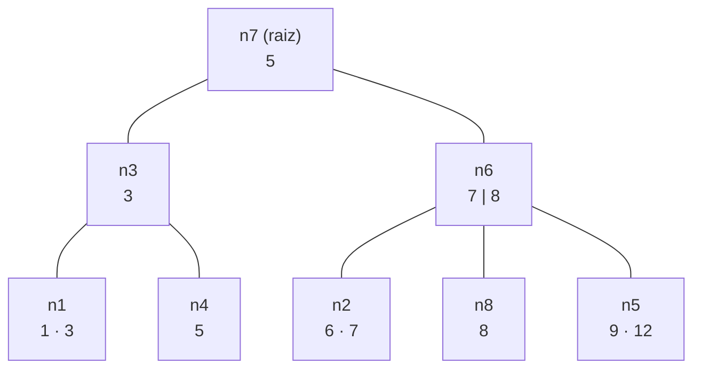
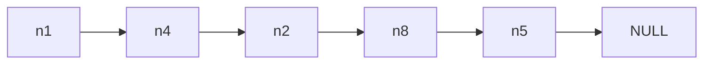
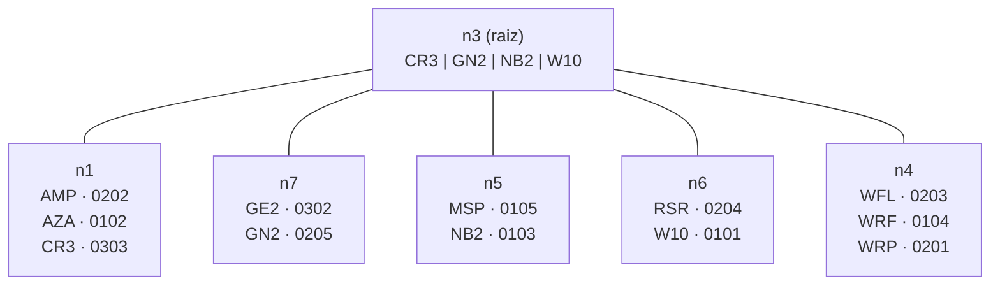
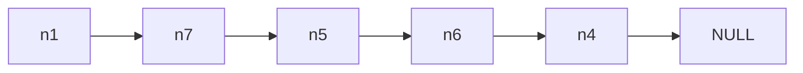

# 🌳 Indexação e Árvore B+

> **Objetivo:** classificar índices, estimar quantos blocos uma busca lê e, principalmente, montar à mão uma **árvore B+**: calcular quantas entradas cabem no nó, inserir com split, remover com empréstimo/unsplit e desenhar o arquivo do índice.

---

## 🧭 Comece aqui

**A ideia em uma frase.** Pense no índice remissivo no fim de um livro. Em vez de ler o livro inteiro para achar um assunto, você procura o assunto numa lista **em ordem alfabética**, e ela diz a página. O índice do banco é igual: uma lista ordenada de `<chave, rid>`, em que o **rid** diz em que bloco do arquivo de dados está a linha. A **árvore B+** é essa lista organizada em **níveis**: a **raiz** diz em que parte procurar, e as **folhas** guardam as chaves com os rids. Cada nó é um bloco, então descer um nível é ler 1 bloco. Com 2 ou 3 níveis, o banco acha qualquer chave lendo 2 ou 3 blocos, em vez do arquivo inteiro.

**O que a questão pede.** O desenho da árvore B+ depois de uma sequência de `INSERT` e `DELETE`, com os nós numerados, as entradas e as setas, e o desenho do arquivo do índice (que bloco é cada nó).

**Palavras que vão aparecer:**

* **Chave de busca**: o valor pelo qual se procura (ex.: o `id`).
* **rid**: o endereço da linha no arquivo de dados, formado por bloco + slot (ver "Banco de Dados: Organização de Arquivos").
* **Raiz / nó interno / folha**: o topo da árvore, os nós do meio (só chaves e setas) e o nível de baixo (chaves + rids).
* **Separador**: a chave de um nó interno que divide "para a esquerda" de "para a direita".
* **Split**: quando um nó enche demais e se divide em dois.
* **Unsplit** (junção): quando um nó fica vazio demais e se junta a um vizinho.
* **Underflow**: um nó com menos entradas que o mínimo (menos da metade da capacidade).
* **Fan-out**: quantas setas saem de um nó, ou seja, quantos filhos ele tem.

**Onde este arquivo se encaixa.** É o **2º de 3**. Os rids das folhas vêm do arquivo de dados ("Banco de Dados: Organização de Arquivos"). O número de níveis ($x$) e de folhas ($b_{leaf}$) do índice entram nas contas de "Banco de Dados: Custo de Consultas".

**Se você está perdido, leia nesta ordem:**

1. Este "Comece aqui".
2. A seção 4 (estrutura e **como uma busca anda na árvore**).
3. O **exemplo clássico (seção 11)**, que é pequeno e mostra todos os tipos de split.
4. O **exemplo resolvido completo (seção 12)**, acompanhando a **Receita (seção 10)**.

As seções 2 e 3 são teoria de consulta; dá para deixá-las por último.

---

## 🗂️ 1. O que é um índice

* Estrutura que agiliza o acesso aos dados: um arquivo com entradas `<chave de busca, rowId>`. É como o índice remissivo de um livro.
* `CREATE [UNIQUE] INDEX nome ON tabela(atributo [, atributo ...]);` varre a tabela, pega os valores e rowIds e grava o índice num arquivo bem menor que o de dados.
* A manutenção acontece sozinha a cada `INSERT`, `DELETE`, `UPDATE`, `ALTER/DROP TABLE`.
* Um índice é avaliado por tempo de busca, de inserção, de remoção e pelo espaço que ocupa. O critério principal é o número de **acessos a disco**.

---

## 🏷️ 2. Classificação

| Índice | Arquivo ordenado pelo atributo? | Atributo único? | Denso ou esparso | Como busca |
| :-- | :-: | :-: | :-- | :-- |
| **Primário** | Sim | Sim | Esparso: 1 entrada por bloco (o 1º registro do bloco é a âncora) | Acha o bloco (maior chave ≤ K) e procura dentro dele. |
| **Clustering** | Sim | Não | Esparso: 1 entrada por valor distinto (ou âncora por bloco) | Acha o 1º bloco do valor e lê até o valor acabar. |
| **Secundário único** | Não | Sim | Denso: 1 entrada por registro | Chave → rowId → registro. |
| **Secundário não único** | Não | Não | Denso (chave repetida, um rowId cada) ou chave + lista de rowIds (um nível a mais de indireção) | Igual, com 1 acesso por registro encontrado. |

* **Denso** tem uma entrada no índice para cada registro. **Esparso** tem menos entradas que registros, e por isso ocupa menos espaço.
* **Mononível (flat):** é um arquivo ordenado de `<chave, rowId>` com busca binária. Inserção e remoção exigem reorganizá-lo.
* **Multinível:** é um índice do índice. Cada bloco aponta para muitos de baixo (*fan-out*), e isso é mais rápido que a busca binária. É balanceado, e os níveis de cima cabem em memória.
* Nos SGBDs, "índice primário" é o **clustering único** (no SQL Server: `CREATE UNIQUE CLUSTERED INDEX`).
* Além dos índices ordenados (o foco aqui), existem índices bitmap e hash.

---

## ⏱️ 3. Quanto custa buscar (exemplo resolvido)

*Se está começando, pule para a seção 4 e volte aqui depois. Esta seção compara números de acessos e usa os termos da seção 2.*

> Exemplo clássico do livro de Elmasri & Navathe. O arquivo tem $r = 30\,000$ registros de $R = 100$ B, em blocos de $B = 1024$ B (unspanned). Uma entrada de índice tem chave de 9 B + ponteiro de 6 B = 15 B.

$$Bfr = \left\lfloor \frac{1024}{100} \right\rfloor = 10 \qquad b = \frac{30\,000}{10} = 3\,000 \qquad Bfr_i = \left\lfloor \frac{1024}{15} \right\rfloor = 68$$

$Bfr_i = 68$ é o **fan-out**: quantas entradas de índice cabem num bloco.

| Cenário | Conta | Acessos |
| :-- | :-- | :-: |
| Arquivo ordenado pelo atributo, busca binária no arquivo | $\lceil \log_2 3000 \rceil$ | **12** |
| Índice primário mononível (esparso: 3 000 entradas, uma por bloco) | $b' = \lceil 3000/68 \rceil = 45$, então $\lceil \log_2 45 \rceil + 1$ | **7** |
| Arquivo não ordenado, atributo com $d = 5$ repetidos em média: busca sequencial | $b$ | **3 000** |
| Índice secundário mononível denso (30 000 entradas) | $b' = \lceil 30000/68 \rceil = 442$, então $\lceil \log_2 442 \rceil + 5$ | **14** |
| Índice secundário multinível | 442 → $\lceil 442/68 \rceil = 7$ → $\lceil 7/68 \rceil = 1$: $x = 3$ níveis, então $3 + 5$ | **8** |

* **Como ler o log:** $\lceil \log_2 b \rceil$ é quantas vezes dá para dividir $b$ ao meio até sobrar 1 bloco. É o número de passos da busca binária. 3 000 → 1 500 → … → 1 leva 12 passos.
* **O "+ 1" e o "+ s":** depois do índice, ainda é preciso ler o bloco de dados de cada registro encontrado. Com chave única é +1; com 5 repetidos espalhados é +5.
* **A altura cresce devagar:** com fan-out 10, os níveis cobrem 10, 100, 1 000, 10 000… entradas. Com fan-out 68, 3 níveis bastam para 30 000 registros.

---

## 🌲 4. Árvore B+: estrutura

* **Paginada** (cada nó é um bloco), **balanceada** (todas as folhas no mesmo nível) e **cresce de baixo para cima** (por split). É boa para busca pontual e por intervalo.
* **Nó interno:** $[P_1, K_1, P_2, K_2, \dots, K_{q-1}, P_q]$, com as chaves em ordem crescente e cada $P$ apontando para um filho.
* **Folha:** $[\langle K_1, Pr_1\rangle, \dots, \langle K_{q-1}, Pr_{q-1}\rangle, P_{\text{próx}}]$, em que cada $Pr$ é o rowId do registro e $P_{\text{próx}}$ aponta para a próxima folha (as folhas formam uma lista encadeada).
* **Convenção "≤ vai para a esquerda":** um valor $X$ na subárvore de $P_i$ obedece $X \le K_1$ (para $i = 1$), $K_{i-1} < X \le K_i$ (no meio) ou $X > K_{q-1}$ (no último ponteiro).
* **Ocupação mínima:** o nó interno (fora a raiz) tem pelo menos $\lceil p/2 \rceil$ ponteiros, a folha tem pelo menos metade da capacidade e a raiz tem pelo menos 2 ponteiros.

### 🔎 Como uma busca anda na árvore

Esta é a árvore final do exemplo resolvido (seção 12). Cada folha guarda `chave rid`, e a última linha é a lista encadeada das folhas:

```
                n3 ( CR3 | GN2 | NB2 | W10 )
      ┌───────────┬───────────┼───────────┬───────────┐
      ▼           ▼           ▼           ▼           ▼
     n1          n7          n5          n6          n4
  AMP 0202    GE2 0302    MSP 0105    RSR 0204    WFL 0203
  AZA 0102    GN2 0205    NB2 0103    W10 0101    WRF 0104
  CR3 0303                                        WRP 0201
     n1 ───────► n7 ───────► n5 ───────► n6 ───────► n4 ──► NULL
```

**Buscar RSR (busca pontual).** Na raiz, compare RSR com os separadores da esquerda para a direita e desça pelo **primeiro** cuja chave é **≥ RSR**:

1. RSR > CR3, RSR > GN2, RSR > NB2, e RSR ≤ W10. Desça pela seta à esquerda do W10 até o **n6**.
2. Na folha n6 está `RSR 0204`: a linha está no **bloco 02, slot 04** do arquivo de dados.
3. Total: 2 blocos de índice (n3, n6) + 1 bloco de dados = **3 acessos**, em vez de ler o arquivo inteiro.

**Por que "≤ vai para a esquerda".** O separador é a **maior chave da subárvore da esquerda**: NB2 é a última chave de n5. Para buscar o próprio NB2, compare NB2 ≤ NB2: verdadeiro, então desça à esquerda e chegue no n5. Por isso, no split, é a maior chave da metade esquerda que sobe.

**Buscar de GE2 até NB2 (busca por intervalo).** Desça até a folha do GE2 (n7) como na busca pontual. Depois **siga a lista encadeada**: n7 (GE2, GN2) → n5 (MSP, NB2), e pare quando passar de NB2. Não precisa voltar à raiz, e é **para isso** que as folhas são encadeadas.

**E quando insere ou remove?** A árvore precisa continuar assim: chaves em ordem, todas as folhas no mesmo nível e cada nó com pelo menos metade da capacidade. O **split** (nó cheio demais) e o **unsplit** (nó vazio demais) são os consertos que mantêm isso. As seções 7 e 8 mostram como fazer cada um.

---

## 📐 5. Capacidade do nó

Cada nó ocupa um bloco de $B$ bytes. A chave tem $K$ bytes, o rowId tem $rid$ bytes e o ponteiro de árvore tem $P$ bytes. Sobra sempre **um** ponteiro: na folha é o da próxima folha, e no nó interno é o ponteiro mais à direita.

$$\text{entradas na folha} = \left\lfloor \frac{B - P}{K + rid} \right\rfloor \qquad \text{chaves no nó interno} = \left\lfloor \frac{B - P}{K + P} \right\rfloor \;(\text{ponteiros} = \text{chaves} + 1)$$

| Chave ($B = 256$, $rid = 64$, $P = 32$) | $K$ | Folha | Nó interno |
| :-- | :-: | :-: | :-: |
| `CHAR(3)`, 2 B por caractere | 6 B | $\lfloor 224/70 \rfloor = 3$ | $\lfloor 224/38 \rfloor = 5$ chaves, 6 ponteiros |
| `INT` de 8 B | 8 B | $\lfloor 224/72 \rfloor = 3$ | $\lfloor 224/40 \rfloor = 5$ chaves, 6 ponteiros |
| `CHAR(10)`, 2 B por caractere | 20 B | $\lfloor 224/84 \rfloor = 2$ | $\lfloor 224/52 \rfloor = 4$ chaves, 5 ponteiros |

* **Underflow** é um nó com menos da metade das entradas. Uma folha de 3 aguenta 2 e entra em underflow com 1. Uma folha de 2 aguenta 1. Um nó interno de 6 ponteiros precisa de pelo menos 3 (2 chaves).
* **"Árvore de ordem p"** (livro): o nó interno tem até $p$ ponteiros ($p - 1$ chaves), e a folha tem até $p_{\text{folha}}$ entradas.

---

## 🔤 6. Ordem das chaves

* Use a regra de ordenação **do enunciado**. Exemplo: "dígitos são menores que letras, maiúsculas = minúsculas".
* Texto compara caractere a caractere, da esquerda para a direita: **W10 < WFL**, porque `1` < `F`.
* Número guardado como texto compara como texto: `'10' < '9'`. `INT` compara como número.
* Antes de inserir, monte a lista ordenada com **todas** as chaves. Exemplo:

```
AMP < AZA < CR3 < GE2 < GN2 < MSP < NB2
    < RSR < RV6 < RV7 < W10 < WFL < WRF < WRP
```

---

## ➕ 7. Inserção

1. **Desça** da raiz: em cada nó interno, siga o primeiro ponteiro cuja chave é ≥ X. Se X é maior que todas, siga o último.
2. **Insira** na folha, em ordem.
3. **Folha estourou** (capacidade + 1 entradas): faça o split. O nó original (que mantém o número) fica com a metade esquerda, $\lceil n/2 \rceil$ entradas, e a direita vai para um **nó novo, com o próximo número**. Encadeie: esquerda → nova → antiga próxima.
4. **Sobe uma cópia** da maior chave da esquerda, que continua na folha, como separador no pai.
5. **Nó interno estourou:** faça o split. A chave do meio **sobe e sai do nó**, e a esquerda fica com pelo menos tantas chaves quanto a direita. Exemplo: 6 chaves num nó de 5 → esquerda com 3, sobe a 4ª, direita com 2.
6. **Raiz estourou:** nasce uma raiz nova (próximo número) com 1 chave e 2 ponteiros, e a altura cresce. O header passa a apontar para ela.

> 🔑 Na **folha** a chave é **copiada** e fica nos dois lugares. No **nó interno** a chave **se move**.

---

## ➖ 8. Remoção

1. **Ache a folha e remova a entrada.** A chave continua nos nós internos como separador, porque ela ainda separa certo.
2. **Sem underflow:** fim.
3. **Underflow → tente emprestar** de um irmão com o mesmo pai, **primeiro o esquerdo**. O irmão só empresta se continuar com o mínimo. Do esquerdo vem a **maior** entrada; do direito, a **menor**. O separador entre os dois passa a ser a maior chave do nó da esquerda.
4. **Ninguém pode emprestar → unsplit** (junta com um irmão). Escolha o irmão pela premissa do enunciado. Exemplo: "o nó da esquerda nunca fica com menos entradas que o da direita". O pai perde o separador entre os dois e o ponteiro do nó liberado. O encadeamento das folhas pula o nó liberado.
5. **O bloco liberado continua no arquivo**, marcado como **livre**.
6. **Pai em underflow:** repita um nível acima. No empréstimo entre internos, a chave passa pelo pai; na junção de internos, o separador do pai **desce** para o nó juntado. Se a raiz ficar sem chave, o filho único vira a raiz e a altura diminui.

---

## 💽 9. O arquivo do índice

* Cada nó é **um bloco**, numerado na **ordem de criação**, não na ordem das chaves.
* O **header** guarda o número de blocos, o ponteiro para a **raiz** e o ponteiro para a **folha mais à esquerda**.
* Um bloco liberado por unsplit **continua no arquivo**, marcado como LIVRE. O arquivo não encolhe.
* A ordem física ≠ a ordem lógica. É por isso que as folhas são encadeadas, e por isso o header precisa saber onde está a raiz: ela costuma nascer depois das folhas.

---

## ✅ 10. Receita na prova

1. **Capacidade** da folha e do nó interno (seção 5) e o **mínimo** antes do underflow.
2. **Lista ordenada** de todas as chaves, pela regra do enunciado.
3. **Insira uma por uma** numa tabela com as colunas `# | chave e rid | folha | o que acontece | raiz depois`. O passo a passo vale nota parcial.
4. **Desenhe** a árvore antes das remoções.
5. **Remoções:** underflow? Empreste (esquerdo primeiro); senão, unsplit pela premissa. Os separadores ficam.
6. **Árvore final:** nós numerados, rid em cada entrada de folha e setas da lista de folhas até `NULL`.
7. **Arquivo do índice:** blocos na ordem de criação, header e blocos LIVRE.
8. **Escreva as regras que aplicou** (desempate de split, irmão do unsplit).

## 📝 11. Exemplo clássico: ordem 3

> Livro de Elmasri & Navathe: árvore B+ de **ordem 3** ($p = 3$: nó interno com até 3 ponteiros e 2 chaves; $p_{\text{folha}} = 2$ entradas por folha). Inserções: **8, 5, 1, 7, 3, 12, 9, 6**. Os nós são numerados na ordem de criação ($n_1, n_2, \dots$). É o exemplo que mostra o split de nó interno e o da raiz.

```
INSERT 8   n1 [8]
INSERT 5   n1 [5 8]                                       ← folha cheia
INSERT 1   [1 5 8] estoura → n1 [1 5] | n2 [8], sobe 5 → nova raiz n3

                  n3 ( 5 )
                 /        \
           n1 [1 5]  →  n2 [8]

INSERT 7   n2 [7 8]
INSERT 3   3 ≤ 5 → [1 3 5] estoura → n1 [1 3] | n4 [5], sobe 3

                  n3 ( 3 | 5 )
                /      |      \
          n1 [1 3] → n4 [5] → n2 [7 8]

INSERT 12  [7 8 12] estoura → n2 [7 8] | n5 [12], sobe 8
           n3 ( 3 | 5 | 8 ) estoura (máx. 2 chaves): 5 SOBE e sai,
           n3 ( 3 ) | n6 ( 8 ), nova raiz n7

                         n7 ( 5 )
                    /               \
              n3 ( 3 )             n6 ( 8 )
             /        \           /        \
       n1 [1 3] → n4 [5] → n2 [7 8] → n5 [12]

INSERT 9   n5 [9 12]
INSERT 6   6 > 5, 6 ≤ 8 → [6 7 8] estoura → n2 [6 7] | n8 [8], sobe 7
           n6 ( 7 | 8 ): cabe
```

**Árvore final:**





## 📝 12. Exemplo resolvido completo

> **Premissas:** blocos de 256 B; chave `id CHAR(3)` com 2 B por caractere (6 B); rid de 64 B; ponteiro de árvore de 32 B; valores ≤ a chave ficam à esquerda; em split/unsplit, o nó esquerdo nunca fica com menos entradas que o direito; dígitos < letras; folhas em lista simplesmente encadeada; o header guarda o nº de blocos, a raiz e a folha mais à esquerda. O índice é o da chave primária de `product`, e os rids vêm do arquivo de dados (ver o cheat sheet "Banco de Dados: Organização de Arquivos").
>
> **Instruções:** 13 `INSERT` (W10, AZA, NB2, WRF, MSP, WRP, RV6, WFL, RSR, GN2, RV7, GE2, CR3), depois `DELETE` de RV6 e RV7, depois `INSERT` de AMP (rid 0202).

**Passo 1. Capacidade.** Folha: $\lfloor (256 - 32)/(6 + 64) \rfloor = \lfloor 3{,}2 \rfloor = 3$ entradas. Interno: $\lfloor (256 - 32)/(6 + 32) \rfloor = \lfloor 5{,}9 \rfloor = 5$ chaves e 6 ponteiros. Uma folha entra em underflow com 1 entrada.

**Passo 2. Ordem das chaves.** `AMP < AZA < CR3 < GE2 < GN2 < MSP < NB2 < RSR < RV6 < RV7 < W10 < WFL < WRF < WRP` (a pegadinha é W10 < WFL).

**Passo 3. As 13 inserções.** 4 entradas numa folha de 3 dividem 2 e 2.

| # | INSERT | Folha | O que acontece | Raiz (n3) |
| :-: | :-- | :-: | :-- | :-- |
| 1 | W10 0101 | 1 | n1 nasce: folha e raiz ao mesmo tempo | — |
| 2 | AZA 0102 | 1 | [AZA W10] | — |
| 3 | NB2 0103 | 1 | [AZA NB2 W10], cheia | — |
| 4 | WRF 0104 | 1 | SPLIT: n1 [AZA NB2], n2 [W10 WRF]; sobe NB2; nasce a raiz n3 | NB2 |
| 5 | MSP 0105 | 1 | [AZA MSP NB2] | NB2 |
| 6 | WRP 0201 | 2 | [W10 WRF WRP] | NB2 |
| 7 | RV6 0202 | 2 | SPLIT: n2 [RV6 W10], n4 [WRF WRP]; sobe W10 | NB2 W10 |
| 8 | WFL 0203 | 4 | [WFL WRF WRP] | NB2 W10 |
| 9 | RSR 0204 | 2 | [RSR RV6 W10] | NB2 W10 |
| 10 | GN2 0205 | 1 | SPLIT: n1 [AZA GN2], n5 [MSP NB2]; sobe GN2 | GN2 NB2 W10 |
| 11 | RV7 0301 | 2 | SPLIT: n2 [RSR RV6], n6 [RV7 W10]; sobe RV6 | GN2 NB2 RV6 W10 |
| 12 | GE2 0302 | 1 | [AZA GE2 GN2] | GN2 NB2 RV6 W10 |
| 13 | CR3 0303 | 1 | SPLIT: n1 [AZA CR3], n7 [GE2 GN2]; sobe CR3 | CR3 GN2 NB2 RV6 W10 |

**Passo 4. Antes das remoções** (raiz com 5 chaves, cheia; folhas encadeadas n1 → n7 → n5 → n2 → n6 → n4):

```
               n3 ( CR3 | GN2 | NB2 | RV6 | W10 )
     ┌──────────┬──────────┬────┴─────┬──────────┬──────────┐
     ▼          ▼          ▼          ▼          ▼          ▼
    n1         n7         n5         n2         n6         n4
 AZA|0102   GE2|0302   MSP|0105   RSR|0204   RV7|0301   WFL|0203
 CR3|0303   GN2|0205   NB2|0103   RV6|0202   W10|0101   WRF|0104
                                                        WRP|0201
```

**Passo 5. Remoções.**

* **DELETE RV6.** n2 fica [RSR], com 1 entrada: underflow. Os irmãos n5 e n6 têm 2 cada, e emprestar os deixaria com 1. Então é **unsplit**. Com qual irmão? A premissa decide:

```
juntar com o ESQUERDO:  n5 [MSP NB2 RSR] | n6 [RV7 W10]       3 ≥ 2  respeita
juntar com o DIREITO:   n5 [MSP NB2]     | n2 [RSR RV7 W10]   2 < 3  VIOLA
```

  O n5 absorve o n2, que é **liberado**. A raiz perde o separador entre eles (NB2) e o ponteiro para o n2. RV6 continua na raiz, porque separador não se apaga, e ela ainda separa certo (RSR ≤ RV6 < RV7). Raiz: `( CR3 | GN2 | RV6 | W10 )`.
* **DELETE RV7.** n6 fica [W10]: underflow. O irmão esquerdo n5 tem 3 e **empresta a maior**, RSR. Fica n5 [MSP NB2] e n6 [RSR W10]. O separador entre eles vira a maior chave da esquerda: **RV6 passa a NB2**. Raiz: `( CR3 | GN2 | NB2 | W10 )`.

**Passo 6. INSERT AMP (0202).** AMP ≤ CR3 → n1 [AMP AZA CR3]: fica cheia, sem split.

**Resposta: árvore final.**





| Ponteiro da raiz | Faixa | Folha | Chaves |
| :-: | :-- | :-: | :-- |
| 1º | k ≤ CR3 | n1 | AMP, AZA, CR3 |
| 2º | CR3 < k ≤ GN2 | n7 | GE2, GN2 |
| 3º | GN2 < k ≤ NB2 | n5 | MSP, NB2 |
| 4º | NB2 < k ≤ W10 | n6 | RSR, W10 |
| 5º | k > W10 | n4 | WFL, WRF, WRP |

São 12 chaves, as mesmas 12 tuplas do arquivo de dados. Foram criados 7 nós, e um foi liberado (n2).

**Resposta: arquivo do índice.**

```
header: nº de blocos = 7 | raiz = bloco 3 | folha mais à esquerda = bloco 1

 bloco   1       2       3       4       5       6       7
     ┌───────┬───────┬───────┬───────┬───────┬───────┬───────┐
     │ folha │ LIVRE │ RAIZ  │ folha │ folha │ folha │ folha │
     └───────┴───────┴───────┴───────┴───────┴───────┴───────┘
                 ▲ liberado pelo unsplit do DELETE RV6

 ordem lógica das folhas: 1 → 7 → 5 → 6 → 4 → NULL
```

* ⚠️ **Outra convenção de unsplit:** juntar sempre com o irmão da **direita** e liberar o da direita. Aí o passo intermediário fica [MSP NB2] | [RSR RV7 W10], o que viola a premissa desta questão. A árvore final sai com as mesmas chaves, rids e raiz, mas a folha [RSR W10] vira o n2 e o bloco LIVRE vira o 6. Siga a premissa do enunciado e escreva a regra que aplicou.

---

## ⚠️ 13. Pegadinhas

* Calcule a capacidade **antes** de tudo, lembrando de descontar o ponteiro que sobra (próxima folha / ponteiro mais à direita).
* Ordene pela regra do enunciado: **W10 < WFL** e `'10' < '9'` em texto.
* No split da folha, a chave **sobe copiada**; no split do nó interno, ela **sobe e sai**.
* Na numeração, o nó que divide fica com a metade **esquerda**; o novo pega o próximo número; a nova raiz também.
* Remover da folha **não** remove o separador do nó interno.
* Tente **emprestar antes** de juntar, e o irmão esquerdo antes do direito.
* O bloco liberado **fica no arquivo** como LIVRE. A raiz raramente é o bloco 1.
* Mantenha a lista de folhas atualizada a cada split e unsplit.

---

## 🔁 14. Variações que podem cair

| Se o enunciado pedir… | Faça |
| :-- | :-- |
| Índice de outro atributo (ex.: `UNIQUE (name)` em `CHAR(10)`) | Recalcule a capacidade com o novo $K$: 2 por folha e 4 chaves por nó interno no exemplo. Ordene pelas novas chaves e use os mesmos rids do arquivo de dados. |
| Índice de chave `INT` | $K = 8$ B; compare como **número**. |
| Muitas inserções seguidas | Espere o **split do nó interno** e o **split da raiz** (exemplo clássico, seção 11). |
| Remoção que esvazia o pai | Propague: empréstimo/junção entre nós internos (o separador do pai desce) e, no limite, a raiz encolhe. |
| "≥ vai para a esquerda" ou "esquerda ≤ direita" | Inverta a regra de desempate e diga isso na resposta. |
| Árvore B (não B+) | As chaves dos nós internos **não** se repetem nas folhas, e cada chave aparece uma vez com o seu rowId. |
| Índice secundário não único | A chave se repete, uma entrada por rowId (ou chave + lista de rowIds). |
