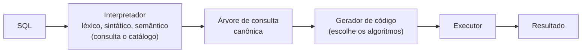
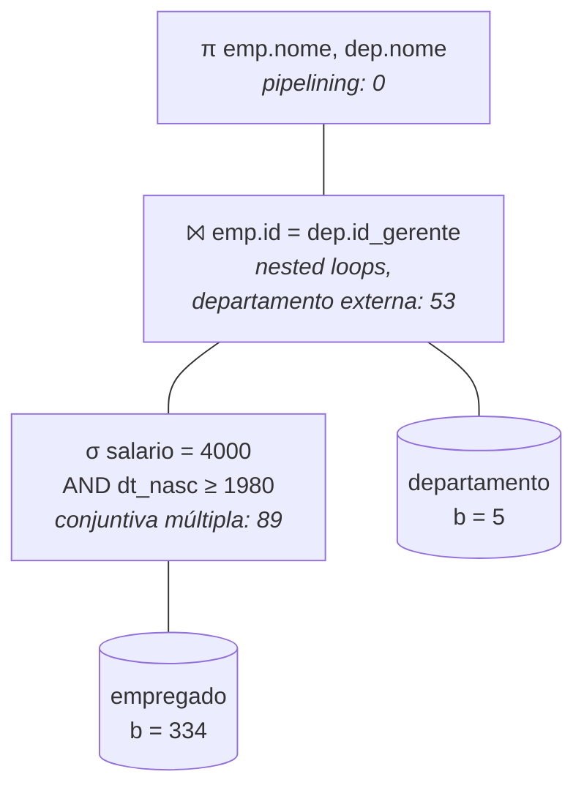

# 💰 Custo de Consultas

> **Objetivo:** dada uma árvore de execução (σ, ⨝, π) e as estatísticas do catálogo, achar o **custo mínimo total em acessos a bloco**, justificando a escolha de cada operação pelo custo de **todas** as alternativas.

---

## 🧭 Comece aqui

**A ideia em uma frase.** O banco consegue responder a mesma consulta de vários jeitos: ler a tabela inteira, usar um índice, juntar duas tabelas de formas diferentes. A parte lenta é **ler do disco**, então o custo de cada jeito é medido em **quantos blocos ele lê**. O banco calcula o custo de todos os jeitos e escolhe o mais barato, e a prova pede que você faça a mesma conta.

**Uma analogia.** Você precisa achar as fichas dos alunos com nota 10 numa pilha com centenas de fichas. Jeito 1: olhar todas, o que sempre funciona. Jeito 2: usar uma lista separada, organizada por nota, que diz onde está cada ficha (um **índice**). O jeito 2 compensa **se forem poucos alunos**. Se metade da turma tirou 10, você acaba abrindo quase todas as fichas de qualquer jeito, e ainda pagou para ler a lista. Toda a matéria é essa comparação, com números.

**O que a questão pede.** Uma árvore com as operações da consulta. Para cada operação: liste todos os métodos possíveis, calcule o custo de cada um (ou diga por que não se aplica), escolha o menor e, no fim, some.

**Palavras que vão aparecer:**

* **Bloco**: a página do arquivo que o disco lê de uma vez. **Custo = número de blocos lidos.**
* **Seleção (σ)**: filtra linhas (o `WHERE`).
* **Junção (⨝)**: combina linhas de duas tabelas (o `JOIN`).
* **Projeção (π)**: escolhe colunas (o `SELECT colunas`).
* **Seletividade**: que fração das linhas passa no filtro. 20% = 200 de 1 000 linhas.
* **Índice**: a "lista organizada" da analogia (ver "Banco de Dados: Indexação e Árvore B+").
* **Buffer**: quantos blocos cabem na memória ao mesmo tempo durante uma junção ou ordenação.
* **Externa / interna**: numa junção por laços, a tabela do laço de fora e a do laço de dentro.

**Onde este arquivo se encaixa.** É o **3º de 3**. Ele usa o número de blocos de cada tabela ("Banco de Dados: Organização de Arquivos") e os níveis e folhas dos índices ("Banco de Dados: Indexação e Árvore B+").

**Se você está perdido, leia nesta ordem:** este "Comece aqui", depois o **Exemplo resolvido (seção 11)** acompanhando a **Receita (seção 10)**. As seções 3 a 9 explicam cada conta do exemplo: volte a elas quando um número não fizer sentido.

---

## ⚙️ 1. Como o SGBD processa uma consulta



* **Árvore de consulta:** as folhas são as tabelas e os nós internos são as operações (σ, π, ⨝; ver o cheat sheet "Álgebra Relacional"). A execução vai **de baixo para cima**: cada operação recebe uma relação e devolve outra.
* **Canônica:** a tradução direta do SQL como foi escrito, uma expressão para o bloco `SELECT-FROM-WHERE-GROUP BY-HAVING`.
* **Gerador de código:** para cada operação, decide quais algoritmos podem ser usados, considerando o que existe (índices, ordenação) e os predicados. É aqui que o custo é estimado.

| | Materialização | Pipelining |
| :-- | :-- | :-- |
| **Resultado intermediário** | Gravado em disco | Passa por um buffer em memória direto para o operador de cima |
| **Custo** | + escrita e releitura | Nenhum acesso extra |
| **Quando** | Operando não cabe na memória | Padrão. Operadores por tupla (σ, π) fluem; operadores que precisam da tabela inteira (ordenação) bloqueiam o pipeline. |

O pipelining usa **iteradores**: `Open()` prepara a operação, `GetNext()` devolve a próxima tupla (ou `NotFound`) e `Close()` libera os buffers. Consequência na prova: **a projeção no topo da árvore custa 0 com pipelining**.

---

## 📖 2. Notação

**Não decore esta tabela:** cada símbolo aparece explicado na conta em que é usado. Quatro deles aparecem em quase toda conta:

* $b$ = blocos da tabela;
* $r$ = linhas;
* $s$ = linhas que passam no filtro;
* $x$ = níveis do índice.

A tabela completa abaixo é de consulta. Os valores ao lado são os do exemplo resolvido (seção 11).

| Símbolo | Significado | Exemplo |
| :-: | :-- | :-- |
| $r$ | Número de tuplas da tabela | empregado: 1 000 |
| $R$ | Tamanho de uma tupla em bytes: **soma de todas as colunas** | 312 B |
| $B$ | Tamanho da página (bloco) | 1 024 B |
| $Bfr$ | Tuplas por bloco: $\lfloor B/R \rfloor$ | 3 |
| $b$ | Blocos da tabela: $\lceil r/Bfr \rceil$ | 334 |
| $d$ | Valores distintos de um atributo | salario: 5 |
| $s$ | Quantas tuplas a condição devolve | 200 |
| $s/r$ | **Seletividade**: a fração das tuplas que passa | 0,20 (200 de 1 000) |
| $x$ | Níveis do índice, da raiz até a folha | 2 |
| $b_{leaf}$ | Blocos-folha do índice | 30 |
| $b_{buffer}$ | Blocos de buffer para junção e ordenação | 5 |
| $n_r$ | *Runs* iniciais da ordenação externa: $\lceil b/b_{buffer} \rceil$ | 5 |
| $g_m$ | Grau de merge: $b_{buffer} - 1$ | 4 |
| $js$ | Seletividade da junção: $1/\max(d_A, d_B)$ | 1/1 000 |

---

## 🧱 3. Passo 1: tamanho das tabelas

$$R = \sum \text{colunas} \qquad Bfr = \left\lfloor \frac{B}{R} \right\rfloor \qquad b = \left\lceil \frac{r}{Bfr} \right\rceil$$

* empregado: $R = 8 + 80 + 16 + 8 + 200 = 312$ → $Bfr = \lfloor 1024/312 \rfloor = 3$ → $b = \lceil 1000/3 \rceil = 334$.
* departamento: $R = 8 + 80 + 8 = 96$ → $Bfr = 10$ → $b = 5$.
* ⚠️ Some **todas** as colunas, inclusive as que a consulta não usa. Esquecer o `endereco` (200 B) dá $R = 112$ e um $b$ errado, e o erro se propaga por todo o resto.

---

## 🎯 4. Passo 2: seletividade

A **seletividade** é a fração das tuplas que satisfaz a condição. Se 20% de 1 000 tuplas passam, a seleção devolve $s = 200$ tuplas. **Quanto menor, mais um índice compensa**: o índice secundário paga cerca de 1 acesso por tupla encontrada. Com 200 de 1 000 (20%) ele ainda ganha da leitura da tabela inteira (207 < 334). Com 350 de 1 000 (35%), já perde (362 > 334).

| Condição | Estimativa | Exemplo |
| :-- | :-- | :-- |
| Igualdade `A = v` | $s = r/d$ (supõe os valores espalhados por igual) | `salario = 4000`: 1000/5 = **200** (20%) |
| Igualdade em chave (único) | $s = 1$ | `id = 7` |
| Faixa, com histograma | Soma das faixas cobertas | `dt_nasc ≥ 1980`: 200 + 150 = **350** (35%) |
| `A AND B` | $s_{A \land B} = r \cdot \frac{s_A}{r} \cdot \frac{s_B}{r}$ | 1000 × 0,20 × 0,35 = **70** (7%) |
| `A OR B` | $s_{A \lor B} = s_A + s_B - s_{A \land B}$ | 200 + 350 − 70 = **480** (48%) |

* **Histograma:** uma tabela do catálogo com a contagem de tuplas por faixa de valores. Em vez de supor tudo uniforme, você soma as faixas que a condição cobre. Se a condição corta uma faixa no meio, entra a parte proporcional (supondo uniforme dentro da faixa). Exemplo: `dt_nasc ≥ 1985` pega metade da faixa 1980–1990, ou seja 200 × 5/10 + 150 = **250**.
* **Independência:** supõe que uma condição não diz nada sobre a outra (saber o salário não ajuda a prever a data de nascimento). Então as frações se **multiplicam**: 20% de 35% = 7%. Use sempre que o enunciado não disser outra coisa.

---

## 🔍 5. Passo 3: algoritmos de seleção

| Método | Custo (acessos) | Quando vale | Exemplo |
| :-- | :-- | :-- | :-- |
| **Busca sequencial** | $b$ | Sempre | 334 |
| **Busca binária** | $\lceil \log_2 b \rceil + \lceil s/Bfr \rceil - 1$ | Arquivo **ordenado** pelo atributo | Não se aplica |
| **Índice primário / clustering** | $x + \lceil s/Bfr \rceil$ | Arquivo ordenado pelo atributo **e** índice nele | Não se aplica |
| **Índice secundário (B+)** | $x + \lceil b_{leaf} \cdot s/r \rceil - 1 + s$ | Índice num atributo que não ordena o arquivo | — |
| **Conjuntiva, índice simples** | Custo do índice de **uma** condição, com o $s$ dela; a outra é testada em memória | Pelo menos uma condição indexada | salario: 2 + 6 − 1 + 200 = 207; dt_nasc: 2 + 11 − 1 + 350 = 362 |
| **Conjuntiva, índice composto** | Custo do índice $(A, B)$ com $s_{A \land B}$ | Índice composto nos dois atributos | Não se aplica |
| **Conjuntiva, índices múltiplos** | $c^{*}_{A} + c^{*}_{B} + s_{A \land B}$ | Índice em cada condição | 7 + 12 + 70 = **89** ✅ |
| **Disjuntiva (OR) indexada** | $c^{*}_{A} + c^{*}_{B} + s_{A \lor B}$ | Índice em **todas** as condições; senão, sequencial | 7 + 12 + 480 = 499 |

**A fórmula do índice secundário, termo a termo:**

$$C_{sec} = \underbrace{x}_{\text{desce até a primeira folha}} + \underbrace{\left\lceil b_{leaf} \cdot \frac{s}{r} \right\rceil}_{\text{folhas com as } s \text{ entradas}} \underbrace{- \,1}_{\text{primeira folha já contada}} + \underbrace{s}_{\text{1 bloco por tupla}}$$

* $\lceil b_{leaf} \cdot s/r \rceil$: as $s$ entradas ficam juntas nas folhas, que são lidas em sequência pela lista encadeada. Com 30 folhas e 20% das tuplas, lê-se $30 \times 0{,}2 = 6$ folhas.
* $+ s$: no pior caso, cada tupla encontrada está num bloco de dados diferente.

**$c^{*}$ é o custo do índice sem o $+ s$:** $c^{*} = x + \lceil b_{leaf} \cdot s/r \rceil - 1$. Nos índices múltiplos, cada índice entrega só uma **lista de rowIds**. As listas são cruzadas em memória (interseção no AND, união no OR), e só as tuplas que sobram são buscadas no arquivo. No exemplo: $c^{*}_{sal} = 2 + 6 - 1 = 7$ e $c^{*}_{dt} = 2 + 11 - 1 = 12$.

---

## 📦 6. Passo 4: tamanho do resultado intermediário

$$b_{sel} = \left\lceil \frac{s}{Bfr} \right\rceil = \left\lceil \frac{70}{3} \right\rceil = 24 \text{ blocos}$$

* Use a mesma $Bfr$ da tabela, porque a tupla não mudou de tamanho.
* O resultado intermediário **não tem índice** e **não está ordenado**. Isso elimina opções na junção.

---

## 🔗 7. Passo 5: algoritmos de junção

| Método | Custo | Requisito | Exemplo |
| :-- | :-- | :-- | :-- |
| **Nested loops** | $b_{outer} + \left\lceil \frac{b_{outer}}{b_{buffer} - 2} \right\rceil \cdot b_{inner}$ | Sempre. Calcule **as duas ordens**. | seleção externa: 24 + 8 × 5 = 64; departamento externa: 5 + 2 × 24 = **53** ✅ |
| **Index-based** | $b_{outer} + r_{outer} \cdot c_{\text{índice}}$ | Índice no atributo de junção da relação **interna**, que precisa ser **tabela base** | índice em `id_gerente`: 24 + 70 × 3 = 234; departamento externa: não se aplica |
| **Sort-merge** | $b_R + b_S$ + ordenações | Ordena as duas pelo atributo de junção (a ordenação some se já estiverem ordenadas) | 144 + 5 + (24 + 5) = 178 |
| **Hash** | $2\,b_R + b_S$ + nested loops de cada bucket | $R$ é a relação particionada | $R$ = seleção: 53 + buckets; $R$ = departamento: 34 + buckets ⚠️ |

* **Nested loops:** a externa (*outer*) é lida em pedaços de $b_{buffer} - 2$ blocos, e para cada pedaço a interna (*inner*) é lida inteira. Os 2 blocos que sobram são um para a interna e um para a saída. Com buffer de 5: pedaços de 3 blocos.
* **Index-based:** para cada tupla da externa, faz-se uma busca no índice da interna. Aqui $s = r/d = 50/50 = 1$ e $c = 2 + \lceil 5 \times 1/50 \rceil - 1 + 1 = 3$.
* **Ordenação:** se a tabela cabe no buffer ($b \le b_{buffer}$), a ordenação é em memória e custa $b$. Senão, é externa:

$$C_{ord} = 2 \left( b + b \cdot \lceil \log_{g_m} n_r \rceil \right) \qquad n_r = \left\lceil \frac{b}{b_{buffer}} \right\rceil \qquad g_m = b_{buffer} - 1$$

* Seleção (24 blocos, buffer 5): $n_r = 5$ runs; $g_m = 4$; $\lceil \log_4 5 \rceil = 2$ passadas de merge (5 runs → 2 → 1); $2 \times (24 + 48) = 144$. O departamento (5 blocos) cabe no buffer e custa 5. O merge lê as duas: 24 + 5.
* **Como ler o log:** $\lceil \log_{g_m} n_r \rceil$ é quantas passadas de merge são necessárias, juntando $g_m$ runs por vez, até sobrar uma só. Cada passada lê e grava a tabela inteira (o fator 2).
* ⚠️ **Hash em aberto:** o termo "nested loops de cada bucket" depende de quantos buckets há e do tamanho de cada um, e o enunciado não dá isso. Com $R$ = departamento, o hash só ganharia se os buckets custassem menos de 19 (34 + 19 = 53). Adote o menor custo **fechado** (53) e escreva a suposição.
* **Tamanho do resultado da junção:** $r_{\bowtie} = r_R \cdot r_S \cdot js$, com $js = 1/\max(d_A, d_B)$. No exemplo: $70 \times 50 / 1000 = 3{,}5$ → 4 tuplas de 312 + 96 = 408 B, $Bfr = 2$ → 2 blocos.

---

## 📤 8. Passo 6: projeção e agregação

* **Projeção sem `DISTINCT`** (bag): $C = b$ da entrada. Com **pipelining**, ela é aplicada nas tuplas que saem da junção e **não soma nada**. Se for materializada, conte o $b$ do resultado da junção (2 blocos no exemplo).
* **Agregação** (com ou sem `GROUP BY`): $C = b$.
* **Projeção com `DISTINCT`:** eliminar duplicatas exige ordenar (ou usar hash). Some o custo da ordenação.

---

## 🔢 9. Arredondamentos

| Grandeza | Arredonda | Exemplo |
| :-- | :-- | :-- |
| $Bfr$ | Para baixo | $\lfloor 1024/312 \rfloor = 3$ |
| $b$, $b_{sel}$ | Para cima | $\lceil 70/3 \rceil = 24$ |
| log (passadas, níveis) | Para cima | $\lceil \log_4 5 \rceil = 2$ |
| Fração de bloco ($b_{leaf} \cdot s/r$, pedaços do nested loops) | Para cima, no mínimo 1 | $\lceil 30 \times 0{,}35 \rceil = 11$; $\lceil 5/50 \rceil = 1$ |
| Número de tuplas fracionário | Para cima (diga) | 3,5 → 4 |

---

## ✅ 10. Receita na prova

1. **$R$, $Bfr$ e $b$** de cada tabela, somando todas as colunas.
2. **$s$ de cada condição** e da combinação (AND por independência, OR por inclusão-exclusão).
3. **Seleção:** uma tabela com **todos** os métodos, cada um com custo ou "não se aplica (motivo)". Escolha o menor e **compare explicitamente com a busca sequencial**.
4. **$b$ do resultado** da seleção.
5. **Junção:** **todos** os métodos, nas **duas ordens**, com "não se aplica (motivo)" onde couber. Escolha o menor.
6. **Projeção/agregação:** diga se usou pipelining.
7. **Total** = soma dos mínimos, em **acessos a bloco**.
8. **Escreva as suposições** (hash, pipelining, arredondamentos).

<div class="page"></div>

## 📝 11. Exemplo resolvido completo

> **Enunciado:** apresente o custo mínimo total da árvore de execução abaixo, justificando o custo mínimo de cada operação pelos custos das demais opções. Buffer para junção e ordenação: **5 blocos**. Página: **1 024 B**.

```
               π emp.nome, dep.nome
                        │
            ⨝ emp.id = dep.id_gerente
              ┌─────────┴─────────┐
              │                   │
   σ salario = 4000.00       departamento
   AND dt_nasc ≥ '01-01-1980'
              │
          empregado
```

**Estatísticas das tabelas:**

| Tabela | Linhas |
| :-- | --: |
| empregado | 1 000 |
| departamento | 50 |

**Estatísticas das colunas:**

| Tabela | Coluna | Distintos | Bytes |
| :-- | :-- | --: | --: |
| empregado | id | 1 000 | 8 |
| empregado | nome | 850 | 80 |
| empregado | salario | 5 | 16 |
| empregado | dt_nasc | 700 | 8 |
| empregado | endereco | 990 | 200 |
| departamento | id | 50 | 8 |
| departamento | nome | 50 | 80 |
| departamento | id_gerente | 50 | 8 |

**Histograma:**

| Faixa de `empregado.dt_nasc` | Tuplas |
| :-- | --: |
| < 01-01-1970 | 250 |
| ≥ 01-01-1970 e < 01-01-1980 | 400 |
| ≥ 01-01-1980 e < 01-01-1990 | 200 |
| ≥ 01-01-1990 | 150 |

**Índices:**

| Índice | Tabela | Atributo | Tipo | Níveis | Blocos-folha |
| :-- | :-- | :-- | :-- | :-: | :-: |
| emp_sal_ix | empregado | salario | secundário | 2 | 30 |
| emp_dt_ix | empregado | dt_nasc | secundário | 2 | 30 |
| dept_id_ix | departamento | id | secundário | 2 | 5 |
| dept_idg_ix | departamento | id_gerente | secundário | 2 | 5 |

**Passo 1.** empregado: $R = 312$, $Bfr = 3$, $b = 334$. departamento: $R = 96$, $Bfr = 10$, $b = 5$.

**Passo 2.** `salario = 4000`: $s_1 = 1000/5 = 200$ (20%). `dt_nasc ≥ 1980`: $s_2 = 200 + 150 = 350$ (35%, pelo histograma). AND por independência: $s = 1000 \times 0{,}20 \times 0{,}35 = 70$ (7%).

**Passo 3. Seleção, todas as opções.**

| Método | Conta | Custo |
| :-- | :-- | --: |
| Sequencial | $b$ | 334 |
| Busca binária | Arquivo não ordenado por salario nem por dt_nasc | Não se aplica |
| Índice primário/clustering | Não existe | Não se aplica |
| Conjuntiva simples, índice de salario | 2 + 30 × 0,2 − 1 + 200 | 207 |
| Conjuntiva simples, índice de dt_nasc | 2 + ⌈30 × 0,35⌉ − 1 + 350 | 362 (pior que a sequencial) |
| Conjuntiva composta | Não há índice (salario, dt_nasc) | Não se aplica |
| **Conjuntiva múltipla** | (2 + 6 − 1) + (2 + 11 − 1) + 70 | **89** ✅ |

**Passo 4.** $b_{sel} = \lceil 70/3 \rceil = 24$ blocos.

**Passo 5. Junção, todas as opções** (buffer 5, pedaços de 3 blocos).

| Método | Conta | Custo |
| :-- | :-- | --: |
| Nested loops, seleção externa | 24 + ⌈24/3⌉ × 5 | 64 |
| **Nested loops, departamento externa** | 5 + ⌈5/3⌉ × 24 | **53** ✅ |
| Index-based, `dept_idg_ix` na interna | 24 + 70 × (2 + ⌈5 × 1/50⌉ − 1 + 1) | 234 |
| Index-based, departamento externa | O resultado intermediário não tem índice | Não se aplica |
| Sort-merge | Ordenar a seleção: 2 × (24 + 24 × ⌈log₄ 5⌉) = 144; ordenar departamento em memória: 5; merge: 24 + 5 | 178 |
| Hash, $R$ = seleção | 2 × 24 + 5 + buckets | 53 + buckets |
| Hash, $R$ = departamento | 2 × 5 + 24 + buckets | 34 + buckets ⚠️ |

**Passo 6.** A projeção usa pipelining sobre as tuplas que saem da junção: 0.

**Resposta.**



$$\text{custo mínimo total} = 89 + 53 + 0 = \mathbf{142} \text{ acessos a bloco}$$

---

## ⚠️ 12. Pegadinhas

* $R$ soma **todas** as colunas da tabela, não só as da consulta.
* Calcule o índice "simples" das **duas** condições: um deles pode ser pior que a sequencial (362 > 334), e isso precisa estar escrito.
* $c^{*}$ (índices múltiplos) **não** tem o $+ s$; o $+ s_{A \land B}$ entra uma vez só, no fim.
* O resultado de uma seleção **não tem índice**: index-based só com a tabela base como interna.
* Nested loops: teste as **duas ordens**. A menor relação como externa costuma ganhar.
* Ordenação: se cabe no buffer, custa $b$; senão, a fórmula externa.
* Arredondamentos na direção certa (seção 9).
* Pipelining: a projeção no topo não soma. Diga que assumiu.

---

## 🔁 13. Variações que podem cair

| Se o enunciado tiver… | Faça |
| :-- | :-- |
| Condição com `OR` | $s_{A \lor B}$ por inclusão-exclusão. Disjuntiva indexada só se **todas** as condições têm índice. No exemplo daria 7 + 12 + 480 = 499 > 334, e a sequencial ganha. |
| Igualdade em chave com índice | $s = 1$. Índice secundário: $x + \lceil b_{leaf}/r \rceil - 1 + 1 = x + 1$. Primário: $x + \lceil 1/Bfr \rceil = x + 1$. |
| Arquivo ordenado pelo atributo da condição | Entram a busca binária e o índice primário/clustering. |
| Índice composto $(A, B)$ | Conjuntiva composta com $s_{A \land B}$. |
| Índice nos dois lados da junção | Index-based nas duas ordens (só tabela base como interna). |
| Tabela já ordenada pelo atributo de junção | Sort-merge sem o custo de ordenar essa tabela. |
| Buffer maior | Recalcule os pedaços do nested loops ($b_{buffer} - 2$), $n_r$ e $g_m$. |
| Materialização em vez de pipelining | Some a escrita do resultado intermediário (e a releitura). |
| `DISTINCT` ou `GROUP BY` no topo | Some ordenação (ou hash) + $b$. |
